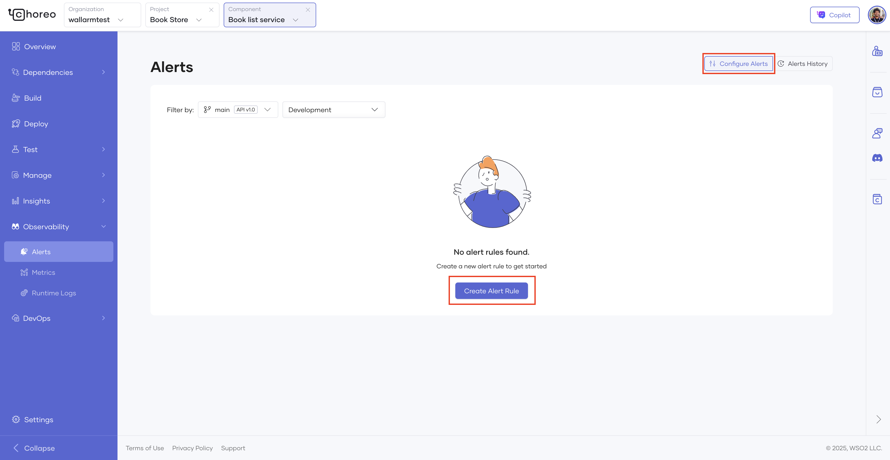
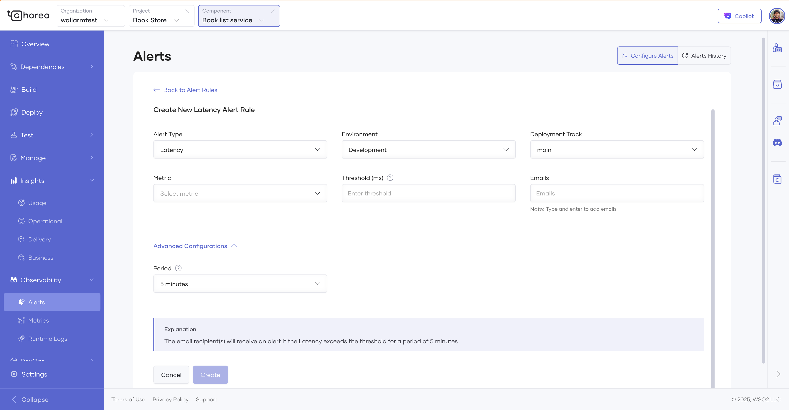
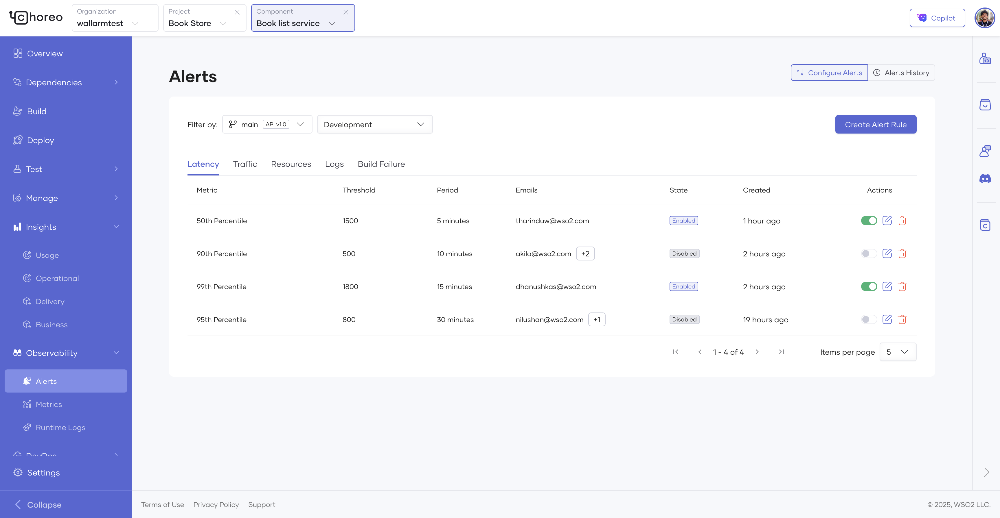
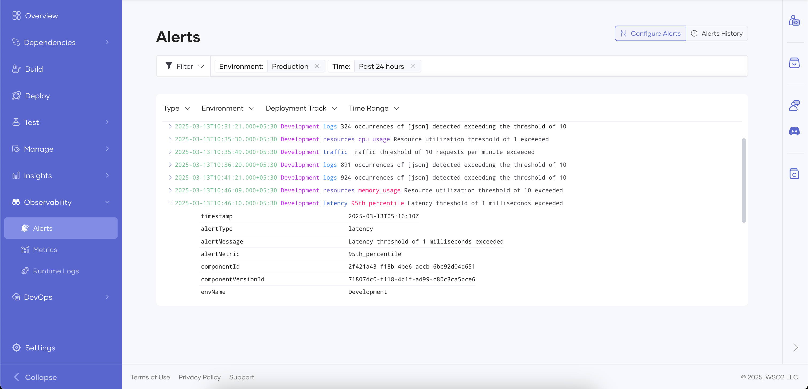
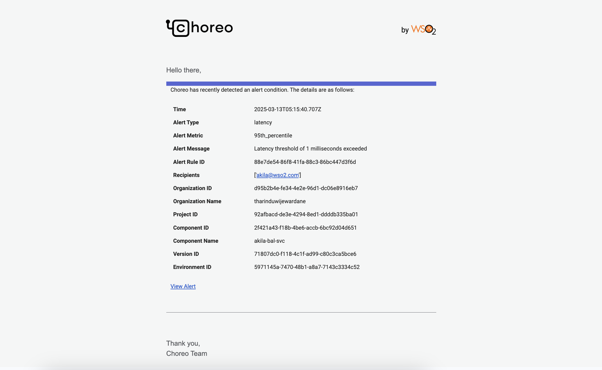

# Alert Overview

This section explains how you can configure alerts for your Choreo components. Setting up alerts allows you to proactively monitor your components ecosystem and take corrective measures when necessary.

You can configure alerts for each environment within your organization. You can add, modify, or delete alerts per component. Optionally, you can specify a list of emails for each alert configuration.

!!! info
    - You can configure a maximum of 10 alerts per component.
    - You can add a maximum of 5 email addresses per alert.

Alerts can be categorized as [latency alerts](#latency-alerts) , [traffic alerts](#traffic-alerts) , [resources alerts](#resources-alerts) , [logs alerts](#logs-alerts), [build failure alerts](#build-failure-alerts) and [status code alerts](#status-code-alerts).

## Supported Alert Types

### Latency alerts

Latency alerts notify you if the response latency of a component exceeds a predefined threshold in a given time period. This is useful for components that need to meet specific SLAs and for proactively identifying slow components.

Configurable Parameters:

- Metric: 99th, 95th, 90th or 50th percentile.
- Threshold: Latency in milliseconds (e.g., 1800 ).
- Period: Duration the threshold must be exceeded (e.g., 5 minutes).

### Traffic alerts

Traffic alerts notify you when the request count of an component exceeds a predefined threshold. This is useful for managing components with backend traffic limits or monetized backends that require proactive scaling based on incoming traffic.

Configurable Parameters:

- Threshold: Requests per minute (e.g., 200).
- Period: Monitoring window (e.g., 5 minutes).

### Resources alerts

Resource alerts notify you when your component’s CPU or memory usage exceeds the defined thresholds. This ensures you can fix the resources allocations early to avoid performance issues or downtimes.

Configurable Parameters:

- Metric: CPU or Memory.
- Threshold: **mCPU** for CPU and **MiB** for Memory(e.g., 1000).
- Period: Duration the threshold must be exceeded (e.g., 5 minutes).

    !!! Tip
        - **CPU**: mCPU (milliCPU) measures CPU usage in fractions of a core, where 1000m = 1 full core.
        - **Memory**: MiB (Mebibyte) measures memory in binary units, where 1 MiB = 2^20^ bytes.

### Logs alerts

Logs alerts trigger notifications when a specific phrase appears frequently in your component logs. This helps identify recurring issues or critical errors quickly, enabling faster troubleshooting.

Configurable Parameters:

- Search Phrase: Keyword or phrase (e.g., failed).
- Count: Minimum occurrences to trigger the alert (e.g., 10).
- Interval: Time window for counting occurrences (e.g., 5 minutes).

### Build Failure alerts

Build Failure alerts inform you if a build failure occurs for your component. This is essential for maintaining smooth development workflows, as it allows quick action to reduce downtime.

### Status Code alerts

Alert you when your component returns specific HTTP errors (e.g., **403** Forbidden, **500** Internal Error). These alerts help detect issues affecting your component’s availability or speed.

Configurable Parameters:

- Status Code: Error code or series (e.g., 400:Bad Request).
- Count: Minimum occurrences (e.g., 5).
- Interval: Time window (e.g., 5 minutes).

!!! note
    Currently Status Code alerts only supports api proxy component types.

## Configure Alert

If you are going to create an alert for the first time, follow the steps given below.

1. Sign in to the [Choreo Console](https://console.choreo.dev/).
2. Ensure you are in the correct organization where you have a project with the component to configure an alert.
3. Navigate to the component by clicking on the project with the component to configure an alert.
4. Click the component.

    !!! info
        make sure your component is deployed in order to make the alerts work.  

5. In the Choreo Console left navigation menu, click **Observability**.
6. In the left navigation menu on the **Observability** page, click **Alerts**. This opens the **Configure Alert** pane by default.
7. Click **Create Alert Rule** to create a new alert rule.

    {.cInlineImage-full}

    {.cInlineImage-full}

    This opens the **Alert Creation** page with the **Latency** alert type selected by default.

8. Select the **[Alert Type](#supported-alert-types)** you want to create.
9. Select the **Environment** you want to create the alert for.
10. Select the **Deployment Track** as required.
11. In the **Metric** field, select the required metric against which you want to evaluate the alert configuration.

    !!! tip
        The list includes all available options. If there are multiple metrics, you can select the required metric. If there is only one metric to choose, that metric is selected by default, and the field is disabled.

12. In the **Threshold** field, specify the threshold in milliseconds.

    !!! info
        When the 95th percentile of the selected metric exceeds the threshold provided here, alerts are triggered.

13. In the **Emails** field, specify the list of emails that should be notified when the alert is added.

    !!! note
        When adding an email, enter the required email and press enter to add it.

14. In the **Advanced Configurations** dropdown, you can select the **Period**, the duration which the metric value must remain above the threshold
15. You can alse see an **Explanation** window, telling what kind of an alert will generate based on your alert configurations.
16. Click **Create**.

17. Once an alert is successfully added, the alert will be listed in the **Configure Alerts** pane where all the alerts created so far for that component.

18. Each alert can be **edited**, **removed** and **disabled** or **enabled** via this pane.

    {.cInlineImage-full}

    !!! note
        when editing the alert, you can't edit the **Alert Type**, **Environment** and **Deployment Track**.

## Alert History & Notifications

### View Alert History

You can check the past alerts that have triggered for your component when you click the  **Alerts History** pane in Choreo Alerts. You can filter the alert history by **Alert Type**, **Environment**, **Deployment Track** or **Version** and **Time Range**.

!!! note  
    When filtering, **API Proxy components** show a **Version** filter and Other components display a **Deployment Track** filter, based on their monitoring context.  

You can click on an alert to expand it and see more details of the triggered alert.

{.cInlineImage-full}

### Email Notifications

When an alert is triggered, **recipients** added to the alert rule recieve an email with **alert details** including a direct **View Alert** link to Alert page in Choreo console.

{.cInlineImage-full}
